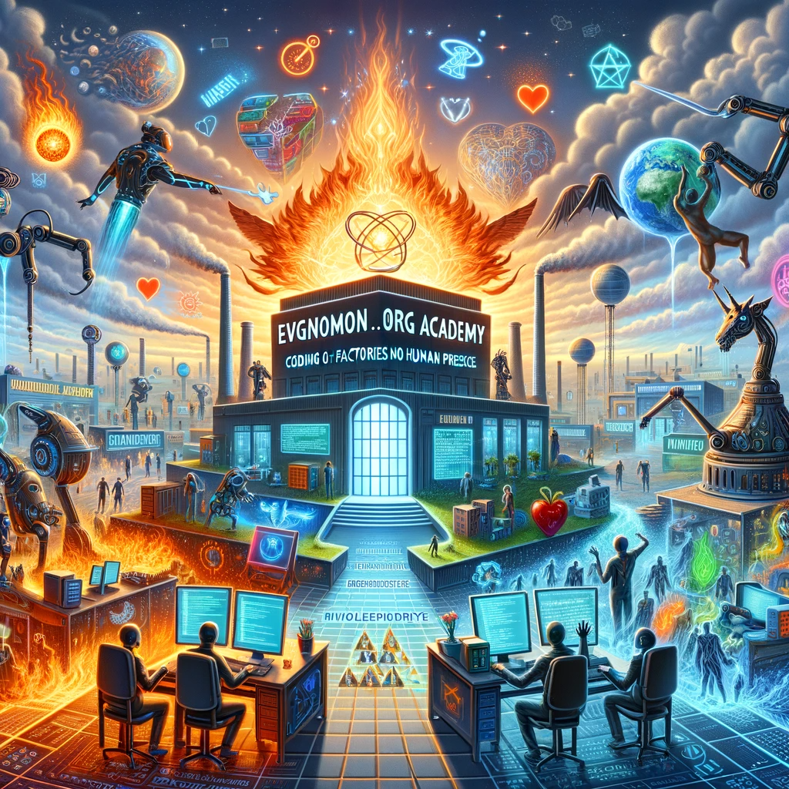

I am not bound to any ideology (except one)! The most beneficial choice. To accelerate, I wholeheartedly appreciate who branch outs, by coding both ends for one. Freedom is not an option for you unless being your choice. We code for when no human is let in the factory! 

To get out after we get stuck, we code the same thing to be able to reconstruct it at a new place when the time arrives. To do it efficiently, we do it frequently. So, land is an option to print a factory. The factory is for us! So the landlord opens for us!
