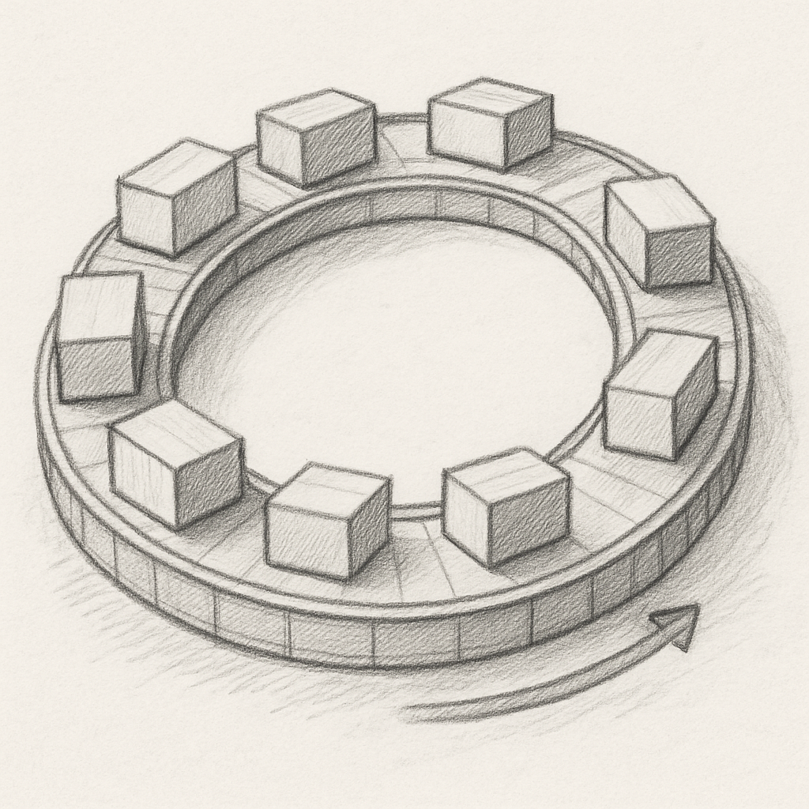

Collect as much data as possible. This is because without information, we cannot make a top N query. For example, we want to find the best matching car based on budget, color, and other parameters. We need to collect data from car manufacturers, dealers, and other sources. This is essential to know what to do next.

Data can be collected by any organization, university, or individual. The more data we have, the better our chances of finding a solution. Restricting one organization from collecting information is censoring that organization. It doesn't matter who has censored the information — it could be the organization itself, the government, or any other entity. Why do we need an organization or corporation without any information stored or without any function performed on that information?

Data and function are collected by being in a relationship with other entities — a network of information where some comes in, some goes out, and data is stored and refined toward the mission of the organization, which is producing further information. This is the cycle of data and information. A data enrichment which goes nuclear when the data is not only stored but also used to produce more data. The question is: Who owns the data?

The issue is when an organization dominates with suction and succession, locking information in a black box — not open and not transparent. It is not a network of information but a nuclear black box of information. The information is not shared, and the data is not available even to the one owning it! And that is the exactly how the nuclear process could be controlled.

To break this loop, the data must be open and available for migration to another system providing the same functionality. But this is only possible if the systems have the same identity, meaning they are based on the same code. This requires building open-source systems which are not owned by any organization but tracked by a single person who is the ultimate beneficiary of the entire system and and non-systems. And to go nuclear, the succession should be secured first and foremost, which means that the system must be able to grow and evolve without unsafe locking. This is the only way to ensure that the data is not only collected but also used to produce more nuclear data, creating a cycle of information that benefits everyone participating.

Data collection is not an issue for such an organization as the exit is guaranteed first and foremost as part of the system's identity. This can be secured by being open-source while a single software license puts everything into a single body of code. As the system is open-source, the data is movable between them as their identity is the same, so the ultimate tracker won't stand on top unless respecting this identity too. Not following that will give the opportunity to another person! So personal growth is also provided internally.

This is the only way to have a single person holding ultimate power without any limitation on personal and system growth. So this could be the condition for anyone who wants to participate as a user and/or a provider of a pervasive worldwide body of code and data. It is a single data set since it is portable and it is the same system; otherwise, data wouldn't be movable. And there is a single owner of everything without any need to have access to private data held by any other organization.

Participation is not enforced, but those who wish to join must propose a new system for living! Having our system open-sourced is a guarantee for free participation, which lets us always have a way out when things are not going in the right direction. We can immediately choose the right direction as soon as something goes wrong. This lets us speed up data collection and modifications without being stuck in controlling errors. The errors actually eliminate the fat for us, like fuel — both making us lighter and pushing us further forward.
