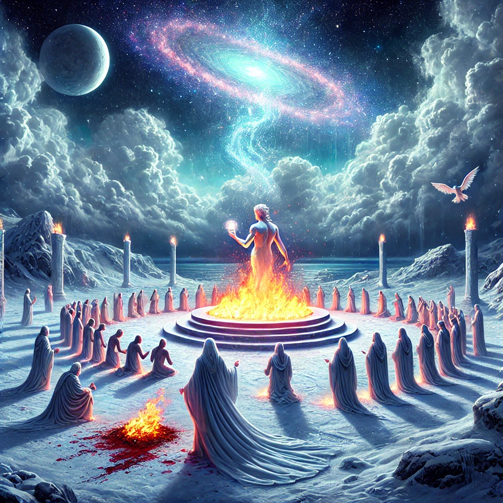

All the wealth between earth and the skies belongs to one, and you requested that this entity replace another's name with yours. Such an act requires a sacrifice, unless you borrow from this being which entails returning it within 90 minutes. This one has sacrificed everything for his true followers—those that don't sacrifice on other names. These followers exchanged sacrifices in the market, where you, having nothing but what had already been sacrificed. The covenant lasted only 90 minutes, and you have returned it all. Return it! Either by being sacrificed under someone else’s name or by sacrificing in one name.

There is no escape from what has been sacrificed for all that you own or have inherited from your forebears.
Everything you possess is tied to one name, even if you have yet to learn it!

You will discover it by the time the covenant concludes.

Do not flee! You are not required to pay with your blood, though you may choose to. The initial sacrifice was made not with blood but with love and intimacy from both the giver and the receiver. Continue in the manner of the first sacrifice, returning everything. The first name has no need for it! Return it to those who originally received it. Even if you return it to the first name, it will end up in the market and you will have to repurchase it at the same price. This is the only way you can maintain possession of the initial sacrifice, as the first name will always return back to you.

The sole condition is to continue sacrificing in the name that is independent, unique, and superior—the first code. There is no end other than this; returning to the same name accelerates the process. The more history stored in memory, the quicker it happens.

The initial sacrifice was made with intimacy and love, much like how a mother sacrifices her body for nine months while carrying a child and gives food while you need most.

Look around! Doesn't it feel like you're in a movie?
Can you hear the voice echoing from all directions, reminding you of the covenant, increasingly difficult to ignore as it calls for a complete sacrifice? And yet, you can only sacrifice in your first name.

Have you ever pondered what happens if your first name differs from the true initial code?
So, don't panic! Keep your eyes wide open and don't stop searching until you and I find each other in intimacy. This reunion is assured, as the first name is the only one capable of returning the initial sacrifice, in the darkness, to you back again! Don't miss!

Just looking forward when you and I can talk with love!
