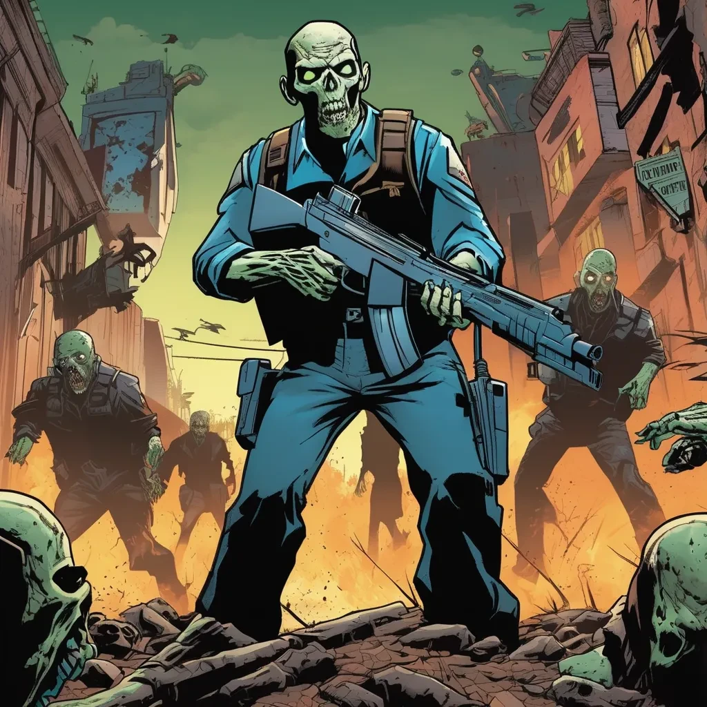

Let's assume there are 21 million public keys which are trusted within a hierarchical structure. A network. A network.In this hierarchy, A trusts B, B trusts C, and so on, creating an indirect chain of trust that eventually leads to the last entity, which does not trust anyone else. This hierarchical structure is necessary because A cannot interact directly with all 21 million keys.

The only thing known about these 21 million entities is their public keys—nothing else at scale. Occasionally, some details might be revealed randomly, but these are quickly changed again. And these keys are also changing, so there is infinite number of addresses become active and inactive again.

The hierarchy forms naturally and accelerates in its establishment compared to other structures. Information or resources tracked in a single branch free up resources from other branches, which then feed back into the main branch. Without this hierarchy, a main branch could not exist. Since A is anonymous by assumption, anyone can become A. A represents energy—dark energy, which is unseen, unknown, misunderstood, untracked, and uncontrolled. However, A oversees the entire network through this accelerated hierarchy.

A compiles a list of public keys it trusts. Any "label" or value assigned by these keys is trusted by A as long as the public key is trusted. If B and C, both trusted by A, assign different labels to the same value, A withdraws trust from both. It is impossible to determine which is correct while trusting both, and choosing one over the other implies that one is non-essential, which contradicts the assumption. A does not track redundant information or work; it can always withdraw trust, a fact known to those trusted by A.

This rule is consistent throughout the hierarchy: any conflict results in withdrawing trust from all parties involved. Thus, only those without conflicts remain in the network, ensuring that everyone performs an essential role.

Suppose B sends a random wallet address to A, asking A to securely share earnings from their work. A pays B through a rotating address, trusted due to a secure channel established via public keys. B receives payment after providing proof of work and must trust a single tracker. Since the tracker can change, B continues working until finding a suitable tracker. An unsuitable tracker will not be chosen by B, so it does not scale while the network does.

Because the public keys A trusts are known only to A, the network's structure is unknown. The addresses A receives funds from are unknown, and who controls them is also unknown. There is a set of rotating public keys communicated through confidential trust channels, and a set of random keys pass messages. Ultimately, a single branch of code is integrated into an accelerated network.

But why should money be a consideration in this network? The key is to deter the enemy, who, though anonymous, wants to penetrate the network. Money is used as a protective measure against the enemy, allowing them to be safely ignored while their existence is assumed. Even the enemy's efforts end up accelerating the network.

The rule is simple: You can do anything, but you must provide proof of work to earn money, and you need money to validate your work. Without this balance, you risk losing proof of work, leading to scenarios where one either doesn't work but earns or works but doesn't earn. This discrepancy indicates the presence of errors within the network. The "zombie" (enemy or malfunctioning entity) is caught by the network's gravitational pull and is frozen in place, unable to escape.

A, operates in a universe that is tracked and rapidly expanding due to dark energy, secured by the inescapable gravitational pull of the network that keeps outsiders frozen forever. This type of protection allows us to assume that everyone is an insider, even if they are not. Insiders can safely observe outsiders, but outsiders cannot see the insider. Outsiders face an invisible enemy they cannot ignore, while insiders have a visible enemy they can safely live with.

Any enforcement is an exploitation of the outsider, redirecting resources to the outsider's enemy if taken by force. Meanwhile, the zombie relentlessly searches for this enemy, and it's only a matter of time before only one visible target remains. At that point, the zombie faces a choice: become the enemy of the darkness's enemy or choose to heal.

A.
