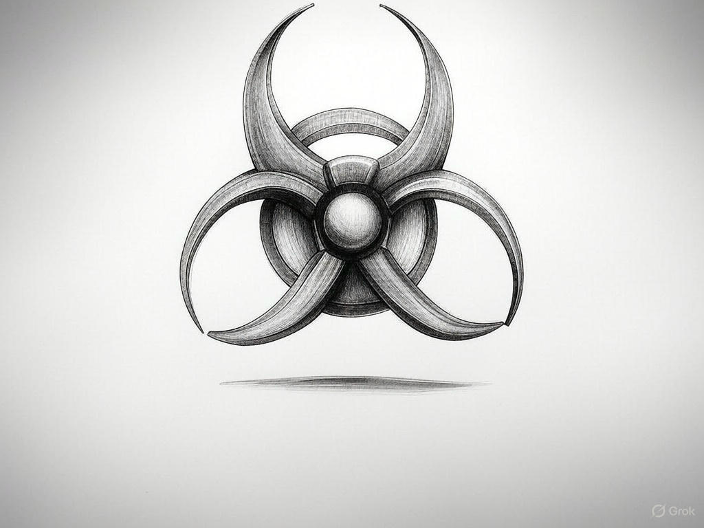

How can a doctor, who has an interest in keeping me sick, help me fight disease?

They can certainly make me suffer and perhaps even kill me with all sorts of biological enemies. Such a doctor does everything except build resistance against biohazards. That’s why time pushes them forward to actually create one by censoring information.

Imagine a highly virulent virus is taken up by that doctor or their followers. The doctor uses vaccines to protect themselves and their followers against that virus and a family of similar viruses. The virus replicates and spreads until it reaches the doctor’s business, where it must mutate to progress. And a variant does. The doctor’s business becomes a host, creating a resident evil, as the virus has no path forward unless it adapts to the resistance developed by the doctor—otherwise, no survival! This virus doesn’t only evolve from its ancestor; it also propels the doctor’s business forward.

The virus enters your body, which is caught up in the doctor’s business and bounce back. You don’t have a normal virus; you have a biohazard unless your body rapidly advances to disable the ever advancing virus. Which requires leaving in a perfect world first. Otherwise more we go, harder it becomes to develop a resistance without getting some information from the doctor. A doctor who first takes and then makes a biohazard by putting you on a mission to receive more information. That doctor is not just a doctor but a biohazard. This process leads to a mess that is not only a virus but also a business exchanging information back and forth. The virus is just a carrier agent in the broader picture.

It becomes ever more difficult to eliminate the biohazard as the doctor inputs more information as data. Building resistance against the biohazard is not only difficult but also impossible, as the doctor is the biohazard itself in the end, who was initially appointed to protect us against biological enemies.

The same type of argument could apply to doctors in different fields. Appoint physicians to take us out of energy, and they take enegy out us! Appoint manufacturers to take us out of machines, they take machien out of us. Appoint chemistry to take us from obsess relation and they take obsess relation from us. Appoint mathematics to take us from a formula and they take formulas our of us. Appoint civil engineers to take a desert out of buildings, they take the buildings out of a dessert. Appoint electrical engineers to take us out of electron, they take the electron out of us. and appoint software engineers to take the information out of data and they take data out of information. Historian to take us out of history, and they take history out of us. And there is still one more enemy not named.

If this isn’t preparing a biohazard detonation, what is the name of this order? Is there any greater, active,  dangerous, powerful, resistant, virulent, contagious, lethal, destructive, harmful, infectious enemy than this? Do you still expect to know the name of such an enemy?

In the end, you appoint the doctor to the government to ensure that anyone who doesn’t pay attention to this order ends up in jail. To solve the problem by putting the “cure” in jail! Read this again, to solve the problem by putting the “cure” in jail! Do you think you can contain the deadliest biohazard in a jail while you and your boss are working for it? You are not only the taker but also the maker of the true, resistant biohazard which prolifrates for sure in a nuclear process.

How can you give attention to nothing, but living in an environment that is actually developing the deadliest biohazard against you. To combat an enemy, I need to use all means, including the enemy’s production and machinery, if the fight targets the largest nameless biohazard all the victims are allies. Not only getting help and giving help but also asking them to integrate to combat the common enemy.

I can also put the enemy in the same situation by developing true resistance against the agents that are used to create the biohazard. The biohazard then comes as an enemy, and goes back in the battle field as an ally. Not only saving myself and the victim but also giving everyone a single mission in the battle field. I can not be more merciful and more gracious than this for myself and for my allies. Any other scenario is a waste of time and energy and such a thing is harmful until we come back to the same point again after waste of time and loss of energy.

What characterizes the enemy is nameless-ness. Let the victims know their names and yours. The victim either accept the name which then join you or just resists which makes your enemy weaker soon as it has built a resistance in benefit of the deadliest enemy who has no end unless predating the hostages for some food in the end when there is nothing more beneficial than that left for a weak parasite.

This is a nuclear reaction that any relation releases maximum energy both in benefit of you and against your enemy at the same time. So that leaves you a reminder to push harder next time. Repeating this process brings the energy level to the point that the biohazard is no longer a threat but a carrier of high energy relationships which exapnds the network forever by building allys in the front line and weak enemies as the carrier of high energy nuclear particles to release even higher energy in new relationships. Gravity is observing spontaneous relationships built ditrctly or indirectly with a node built over time fueled by the dark energy. Which is started in the rapid exapnsion phase to the first particle with enough energy to start the chain reaction in the network.

And the enemy is going to repeat the same process to build a new biohazard which becomes actually an ally at some point. And the only way they can protect themselves is to predate the victim while they are in a concentual relation in order to live a bit longer! And to protect ourselves and the victim against the predator we give all options to the victim except coming back against us in the final battle by what they have taken from us. The enemy has the same strategy in its relations and our main difference is ours doesn't give a name to the enemy as we only have one nameless enemy, the rest are allies either by making us or by taking us against that single enemy.
