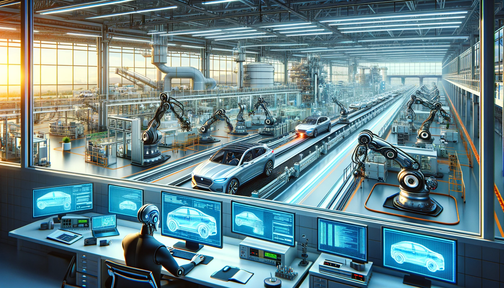

A quintessential example of high-tech technology, traditionally requiring substantial organizational resources, is automotive research and development (R&D) and manufacturing. In this realm, car manufacturing is executed by specialized robotic arms. However, these same assembly lines can be adapted to produce various products under a strict rule: "No human presence is allowed inside the factory." This restriction ensures that only robots, programmed remotely, enter the facility for maintenance or part replacements.

Consequently, cars can be assembled remotely by programming instructions for the machines. After manufacturing, the cars autonomously drive to the customer's garage. Similarly, parts production and material supply are automated, with suppliers replenishing warehouse stocks as needed. This type of factory could operate indefinitely, overseen by software developers who continually update and improve the system through code modifications submitted via pull requests. The entire production facility is monitored by a regulatory body which itself is a code!

Should such a futuristic car manufacturing plant become a reality, it would pave the way for a broader range of connected automated processes. In this scenario, the primary occupation would involve software development, focusing on continuous improvement and innovation of the code that powers these advanced systems.
