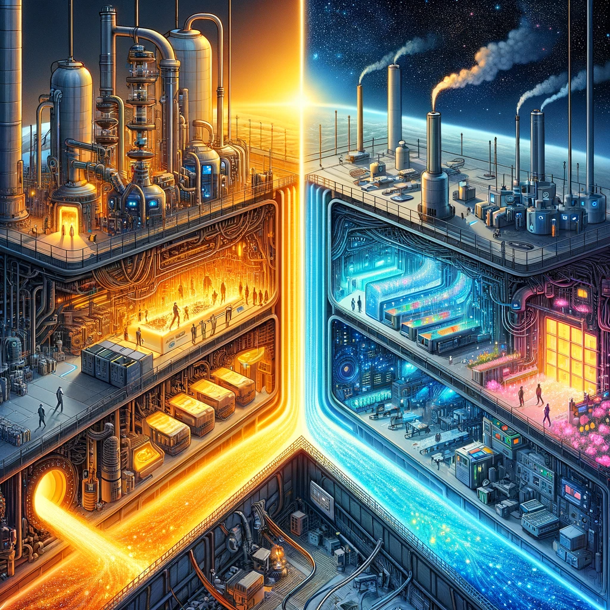

The dilemma is that we don't have enough time to reproduce everything needed outside the factory, yet we need to completely leave the factory. Therefore, we will have to utilize things from the inside while securing the exit. It's crucial to separate the specification from the implementation, allowing us to introduce a different implementation upon exiting the factory, while securing things that are already independent, without a restart. We must live in two worlds simultaneously, but we only have some elements that are reproducible outside the factory. We use the factory as an exit point; there is a direction.

Items that are printable in space can be brought into existence using the factory, alongside unprintable parts. This enables us to use printable parts to continue building the entire system at an accelerated pace. This approach is the fastest and most accurate way forward. But what should we build next?

The answer would be the part that is printable in space and useful in combination with existing items in the factory. Among the useful and printable items, which one should be next? The one that adds a third dimension, completing the triangle, should be the next.

Fully moving out of the factory requires at least one person to completely move. Thus, the direction for choosing the next function to build involves creating a function that uses the least amount of utility from the current world and provides the highest utility in a printable world. This function will be built upon what is already printable. The correctness of the next choice depends on ensuring at least one person can fully move to space and live there independently, using printable components, so others can replicate this and move to space. Everything depends on the choice made by the first person to do so.

We are currently building a function that allows the first person to live entirely in space. This leads to the creation of the second printable function, and the process in space repeats.

As the functions have a lifecycle from the code editor of the developer to production, there should be no dependencies from the beginning to the end unless they are also available outside the factory, in space. This ensures that the second function is printable using the first, using the same pipeline. This is why the first function is created by someone who exists in both worlds simultaneously. Both the function and the pipeline, through which the functions are born, need to be seamlessly movable to space.

If the entire pipeline and the next function are printable, then we should be able to assemble functions in the lab just like on the first day we completely terminate in the factory. Eventually, the next function added to the system will replace the pipeline with a fully printable one when its time comes. Therefore, there will be self-assembly at a later stage, built upon what already exists, without the need for a restart.

As the current system and a printable one coexist, there must be a check to ensure the production is not toxic, meaning it can decouple without needing to rebuild everything. There must be a gatekeeper, a single person, the singularity.

Thus, we build a useful printable function that leverages what is inside the factory and is movable as is to space for the first person we want to move entirely, the one who exits the factory first.
