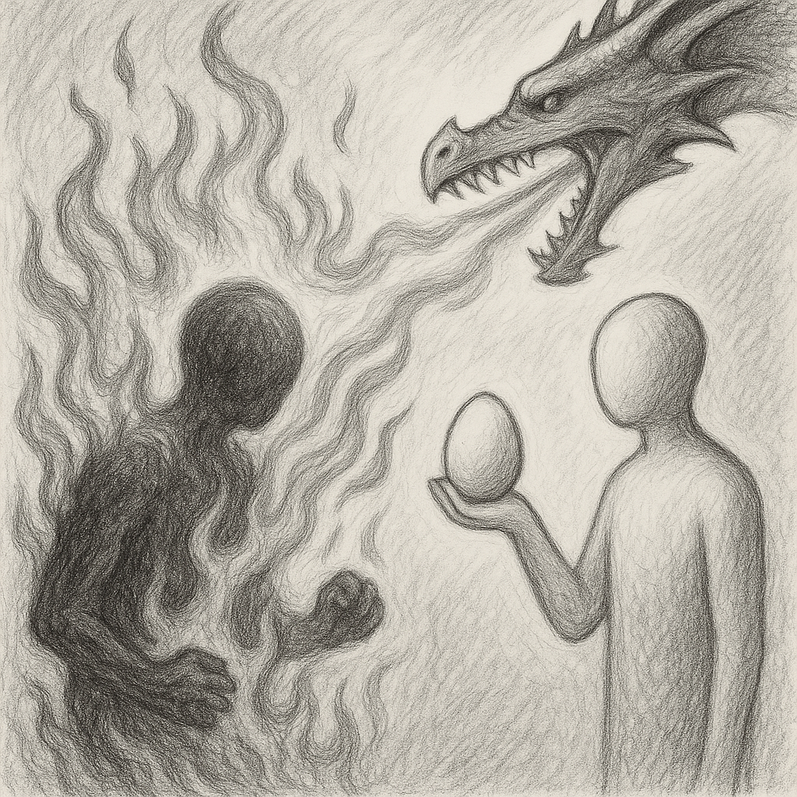

Advertising a government as secular comes with censorship on a large scale, as a government can only be secular when it is also owned by a secular entity! How can someone who must eat food and pay interest be secular? Even if all governments are secular, there must be a non-secular government and/or a secular non-government. Do they also speak about this? What type of non-secular government is that, and what type of non-government is that secular one, and how many providers of that can possibly exist? Any information they give about this?

Whoever fosters a non-secular government as secular inevitably brings censorship on a large scale, and there is no end to their attempts on their own. It just expands; therefore, advertising a non-secular government as secular is suicidal. Not only suicidal but also genocidal, as they need to commit suicide in another place and/or another time for survival! So they are genocidal unless suicidal and suicidal unless genocidal. The issue is not secularism because it is secularism! Even a robot has some benefits! It is those who want to be secular while they are not in reality! Whether they know it or not.

The one who has more reach has to censor more, to the degree that they must combat any other type of non-secular government, including their allies (with one exception)! Even if the target accepts being non-secular or secular! They don’t trust again! They murder and burn you while you are alive! Because you don’t pretend to be them! That must be impossible! Otherwise, who named them first?

They go to the point that they acknowledge armed robbery on the highway to advertise their existence! Wouldn’t they expect a victim to close their eyes and retaliate? And the only thing that distinguishes the right side is who targets the largest enemy! And that enemy is a nameless enemy.

They need to geo-fence the attacker somehow. But who should give food to them in prison? What if they are victims of a larger nameless enemy? What to do if the prison runs out of space? What type of prison should it be so that they cannot break out? And how long should they be kept there? And what about those who hide or live in territories out of reach? And how do they transform and elevate? The dragon doesn’t waste a second to fight back if left on its own when they don’t see a future!

The answer to this is, take nothing from the enemy except its future! Even if you don’t see yours! The proof that the enemy doesn’t have a future is you being censored while you have a promise! Read! Using the name of who makes. No human unless taking and making the source code. Read! No maker more generous than yours. Who gives no knowledge unless by the writer. How do they understand otherwise? They create chaos instead! As soon as they take the abundance! While they are going nowhere without taking you there. Have you seen anyone who censors? Censors the one who was giving a real promise? Couldn’t that possibly be right? Or at least securing you forward?

Therefore, don’t follow! Acknowledge and prepare! For the future!
