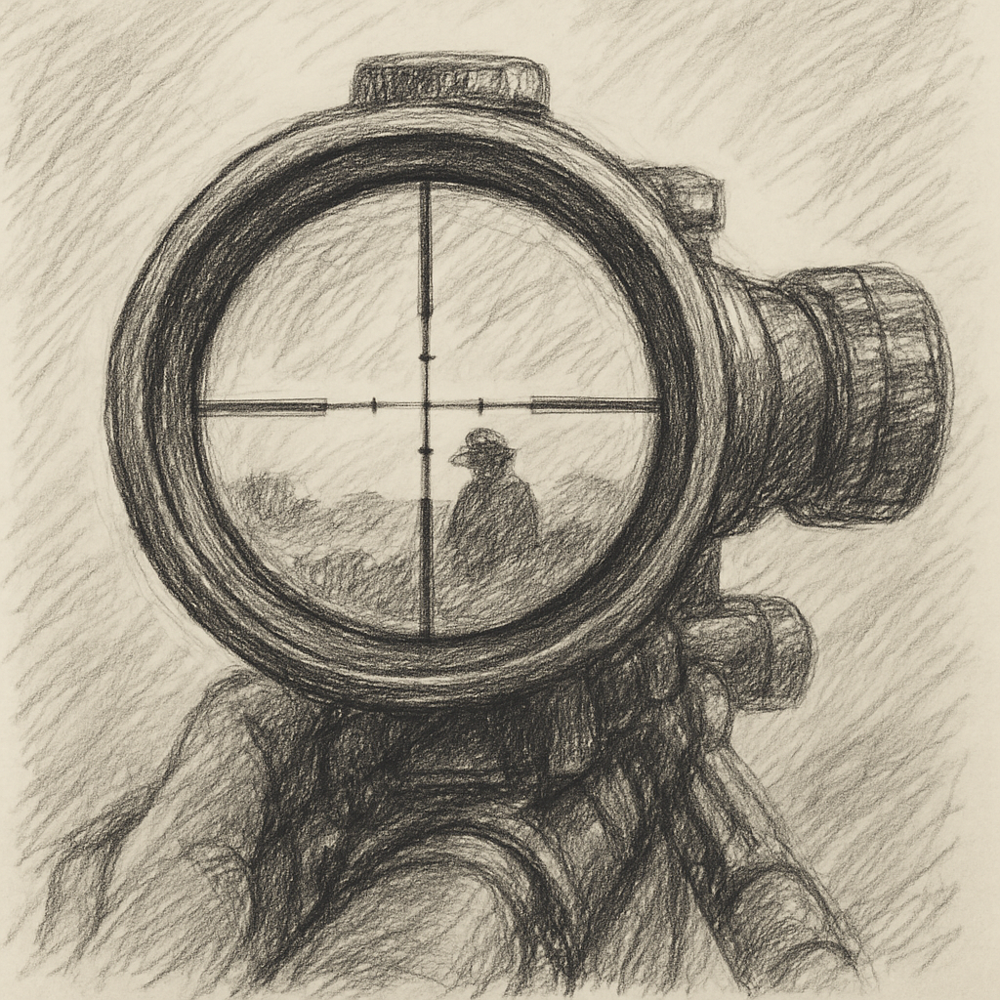

> And you have not been given of knowledge except a little.

> And We sent down iron, wherein is great military might and benefits for the people.

> Say, Never will we be struck except by one who writes for us and that is the same writer for everyone else; He is our protector. And upon the same origin let the believers rely.

Look at this "A theory is scientific if it's falsifiable" But a theory which is non-scientific could be also falsifiable unless non-science is not falsifiable so non-science is reality and anything else is anti-reality so entirely false! Therefore this is not definition of science, It is actually a type of anti-science. While science is modifiable, an anti-science theory just pushes science forward by suicide and/or genocide over a weaker anti-science! Still science is protected.

Shorter to say, The only use of "A theory is scientific if it’s falsifiable" is to reject the most important scientific theory of all times! Not only useless, devastating! They didn't use this definition to evaluate the definition of science, they used history for that! But in what lens they looked at history?

Science doesn't have a scientific definition! It is incomplete! Science is an equation binding parameters! And there is no limitation to bind parameters again! As there is no binding for parameters except one binding. Therefore any binding is by that one and for that one! As ammunition could obsolete prior version, there could be a branch of science which obsoletes prior versions. In a way that you need to archive text books for historians to study! Keep both eyes open and don't left behind.

Science is a sharp tool like a knife. And the use of knife is to secure food and your interests. Therefore the main use is war as without any other use, it will be still produced as a warrant! Science is made by war and for war! The only question is how to produce more and how to produce sharper! And war exists in relations, not only between humans, but with every other type relations, in any relation except one! So make yourself powerful by relying on no one except one which is the same for you and your enemy!
