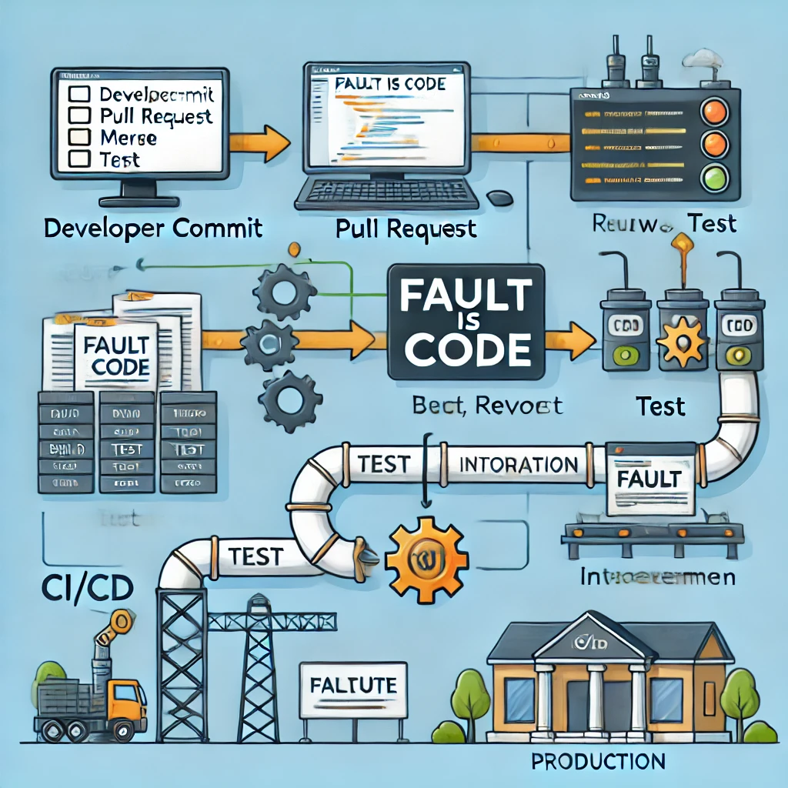

I clone a git repo, make a modification, commit, push, and create a pull request. The pull request is reviewed, merged, and the change is built, tested, and deployed to an integration environment before going to production. This process can be applied to any software project with an integration environment. Without it, we only know the code works on the developer's machine and passes CI tests perhaps unless this level is all expected.

The production environment, used by end-users, is essentially an integrated environment. If further integration is needed without end-users, it is flawed unless considered a form of production but not released. For instance, multiple features might need to be released together, or experimental features integrated without impacting the user experience. From the developer's perspective, all environments are production environments, except for one key distinction.

Some things can't be pragmatically tested, like deployment scripts, which may fail due to unforeseen issues like target machine updates or network problems. Thus, a shadow environment, mirroring production but not used by end-users, is necessary. Changes here immediately proceed to actual production, making this environment irrelevant to developers.

We often need a separate production environment acting as a buffer for meaningful user changes. This "beta" environments allow product owners to track progress and provide usability feedback, influencing release priorities and preventing frequent, potentially annoying updates to end-users.As "beta" is a production environment, it should be treated as such, with the same level of care and attention to details as any other production environment. It is actually a version in this environment which get released to the end-users, there is no second "production" environment. There is just one.

From a developer's viewpoint, everything follows a series of git changes, with each change merged before the next. Manual clicks should be unnecessary and replaced with automation. A proper CI/CD pipeline functions like a messaging system: changes are pushed on one end and applied on the other. Any issues should trigger an automated rollback to the last working version, avoiding manual retries.

If correct execution is attributed to the code, then faults must be attributed as well. The concept of "retry" should not exist if it simply involves pressing a button again which could be automated. If that is more than that, what is checked as a fix? How can anyone apply a fix before it reoccurs? unless it is specified somewhere as a comment or action log saying what was the fix. The conclusion could also be anything except an empty git commit with a message saying "Nothing is checked! Never mind!" No other way to ensure that we hopefully find a fix before the fault, or a new one like that, reoccurs again.

If the fault is code, then apparently there is no fault that is possible to fix unless by modifying the source code. Otherwise that "fault" is not a fault, it might be a feature if not a joke! Even in that case no need for a bare retry, just remove the check! as that check was against something!

Just minimize empty commits, and comments. For the sake of having a source code that is independently talking on its own while it is not depending to anything for the sake always being effectively working.
