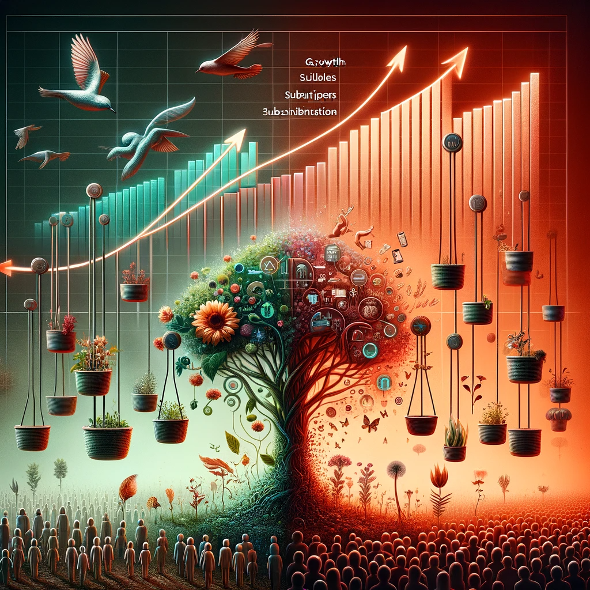

A sustainable population requires a fertility rate of around two or slightly more, on average, as suggested by mathematics. A lower fertility rate implies that children are seen as less useful.

When subscribing to a product, its utility normally increases over time, accelerating its value and potentially reducing its cost. This principle can be similarly applied to children, but with a negative cost implication. The negative price means, if you do not sell it, nothing would be bought from you and if you sell, it will be definitely bought. The less children are 'utilized' in a society, the more expensive they become in the subsequent cycle, until they are perceived as a problem rather than a solution, making the prospect of having children less attractive to families.

The negative cost associated with children stems from their long-term utility, akin to an investment given that the return on investment for a child impacts the entire system, while the cost is borne by the individual. However, a decline in the number of children (akin to losing subscribers) increases the marginal cost for subsequent children in response, as the system supporting them shrinks, thereby increasing the familial cost at the same time reducing the overal impact of a new kid on the whole system. As a result, the 'investment' becomes less attractive, with the next child facing more challenges.

Addressing this issue now is more feasible than attempting to resolve it in the future. The solution may lie in transitioning to a system where the fertility rate does not continue to decline. The continuous decline in fertility rates, akin to a free fall, will persist until a significant global event resets it within a new, more sustainable system.

In a system that is increasingly inclined towards having fewer children, adding another child extends the lifespan of this system, this is a contradiction and not sustainable. Subscriptions are about growth and acceleration, whereas a declining fertility rate is analogous to a subscription to decline or 'death.'
