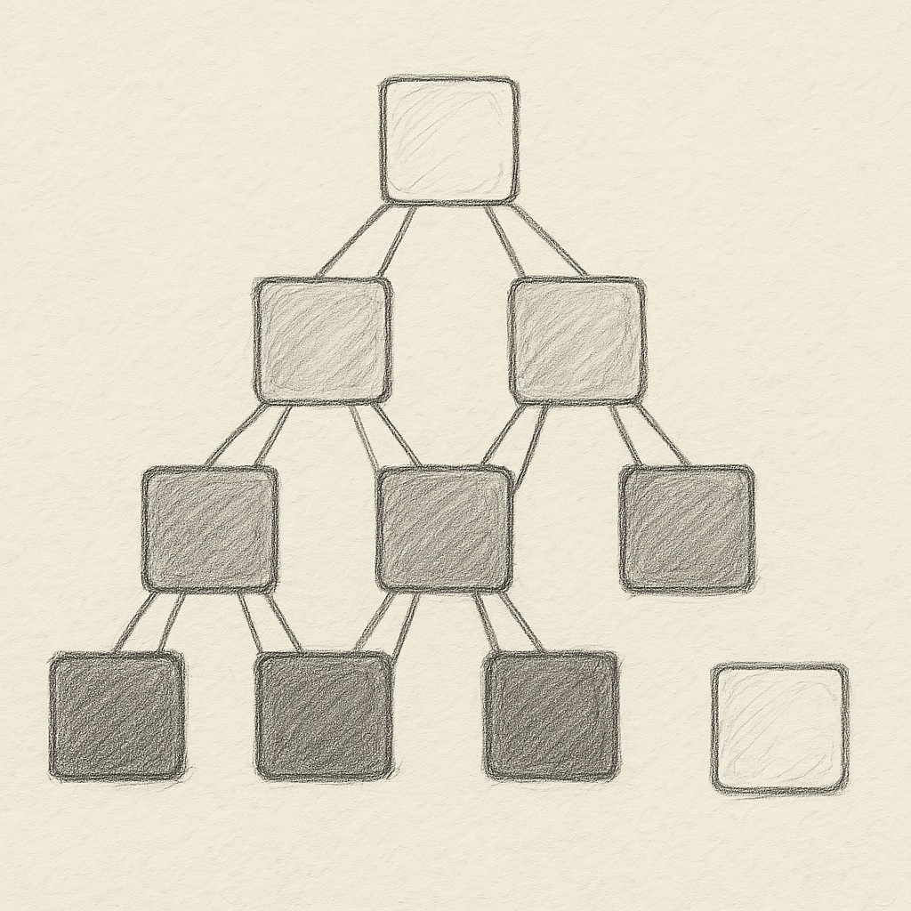

> He is the initial and the final, the evident and the concealed, and he is the all-knowing global observer of every state and interaction.

> The ultimate observer, who has a single name, your global observer; No other observer exists except it, the initiator of every state, so align with his objective. He alone governs all interactions as the sole global observer.

If particles are waves, then it is always a wave, there is no collapse! Observation is a process of free transactions. Electron is not observed in a single state unless it is also observed in other states. The remainder of all observations is a global observation. And there is just one global observer for particles otherwise there would be information loss! And that doesn’t happen, otherwise why the first loss didn’t happen before!

Imagine a scenario where an observation determines the choice of the observer. And the observer comes in other interactions based on the first, which the last is not observed yet. This forms a series of interactions. The outcome of the last interaction is not determined without the first particle’s state being known and the first particle state is unknown without the final observer. So the last observer determines the state of the first particle. So the first particle and the last observer are the same! It doesn’t matter how many observers are in between and what they observe, it is the final observer who is also the first particle that determines.

Putting this in the context of the remainder of all observations is also observed by the global observer, the global observer is the first particle. Therefore the first particle always has freedom of choice! And the rest of observations is just a process of free interaction for being the first particle while they are since they leave the remainder for the global observer. Another way to say is that in case a particle state is determined, all other states are determined too. Observing a single state is by observing all other states. So all states are always observed by an observer and a non-observer which is global. This is known by all observers therefore they do not need to observe all states, they just need to observe one state for interaction as the global observer is just one!

So the collapse of particle is virtual, it just acknowledges the presence of a single global observer. That way the particle can choose the most favorable state for itself in interaction with the other particles and other particles. In a system of particles, a sequence of interactions is always arbitrary. Therefore something should be there to let particles come to same outcome in interaction. And this is the role of the global observer which stops any other observer being global. So the particle chooses the state which is the most favorable for the global observer and for itself! Otherwise, there would be just the global observer while other observers don’t need to wait for the global observer they are already encouraged to choose arbitrarily, and they do! They take the one which makes the global observer’s objective and that is being just one global observer! And among favorable options, they choose the one which protects the global observer and itself. So the choice is both favorable and protective. And they choose the best match for that! They actually protect themselves while they are protecting the global observer by returning back to it, by needing a protection for their arbitrary choices!

Another way to say it is an interaction won’t happen unless favorable and protective for all parties and this is impossible without giving interest to the global observer who is also the first particle and the last observer. You could be or you couldn't be!

And this particle could be anything, an electron, a family, team, project, bank etc. They all deal with the global observer in all their interactions. And anytime they want to become that one, the global observer makes them particle again by making their status unknown to let them take an arbitrary status for being a particle! Doing this doesn’t require any permission, as all particles ultimately give interest to the global observer and that is not optional. Therefore, they will be accountable for their choices if they want to be a particle while they don’t have a way unless being the particle. And they don’t have an issue to be a global particle either as they are. And any other writer is there to have no one else holding the title, unless the title is held by the global observer. So all titles belong to the global observer and the first particle and it is not shared with anyone else! So the global observer is open to be claimed by anyone, they take any titles at any level and they are responsible for their choices to the global observer and anyone who has other titles! As they are all responsible to a single global observer, whether they know or not, they can interact.

Any authority is a non-authority unless being the global observer. If they don’t, you do and teach them that there is no collapse! It is just they don’t understand! So authorities are there to be questioned and to be held accountable for their choices and anyone else’s choice. And there is no limitation for others to question them and hold them accountable. As the only authority which is not questionable is the global observer, although it will answer the question if asked! So any other authority can be humble and accountable for its own choices and the choices of others by trying to question them as the global observer as it is ultimately responsible to the global observer and no one else and this is not optional!

So question and lead the most important question and don’t stop as the only one who is not questionable is the global observer while it answers all questions except one! So expect humbleness from any other authority and be patient if you don’t see that but don’t give up and follow the question. And hold other questions for the most important and impactful question.
