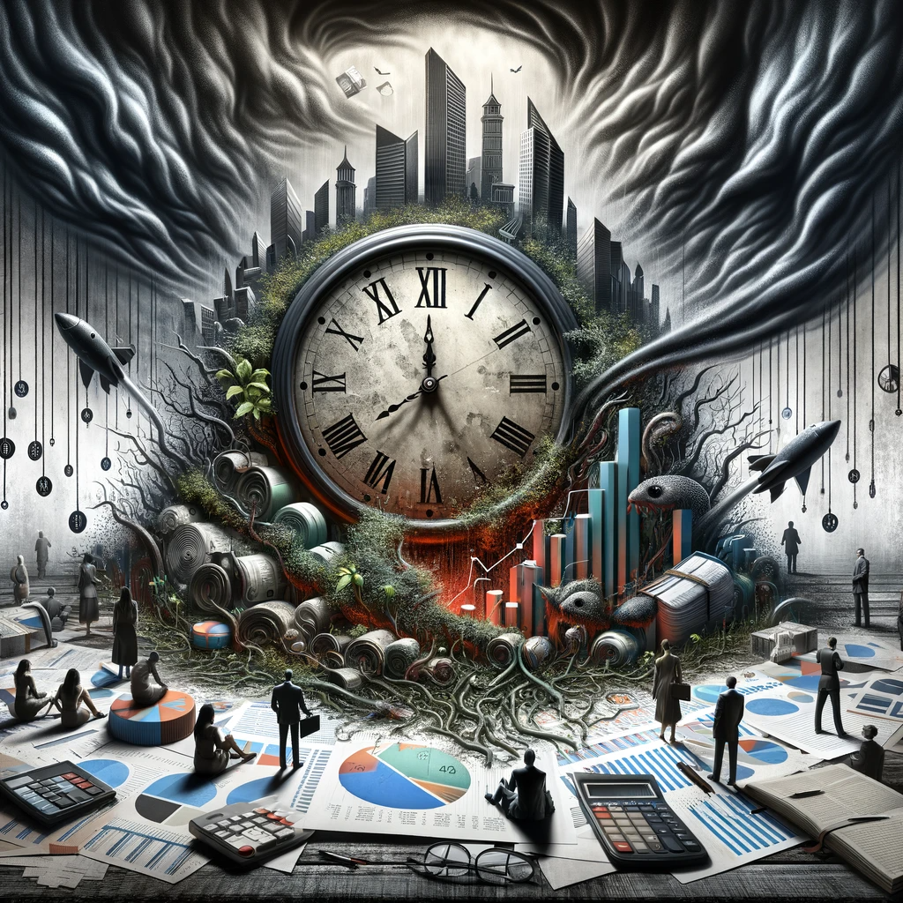

The currency holds value if the government controls the currency supply and currently mandates taxes to be paid in that currency. This compels you to earn in that currency, highlighting who controls it.

Moreover, the government can redeem bonds using this currency and issue them as well. Therefore, the government influences interest rates, manipulating them to any desired level, provided it has sufficient authority.

Thus, the interest rate targeted by the government is arbitrary. It reflects their desired rate.

If borrowing is challenging and time-consuming, interest rates are high; otherwise, they are low. This rate varies individually; there isn't a uniform interest rate, and if there is, it doesn't align with the government's advertised rate.

Simply, you can disregard this rate entirely! Centrally changing that rate to ease or make difficult on average, doesn't solve how much in total it would be in debt in the long run. It is always debtful in the long run. The only thing that controls this is to set a time that debt doesn't grow after that. If this time is not now, it will never happen before the next extinction.

