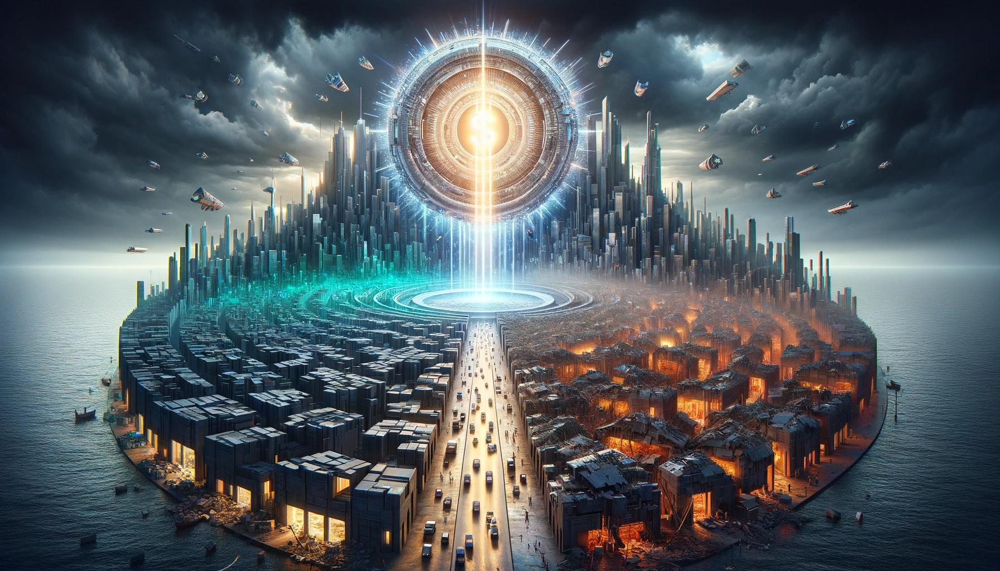

Let's assume you have subscriptions to a few online shops that provide utilities and food.
And a car, flat rental, and things that you need to keep up with living in general.
Basically, things go in and out from the credit card without you needing to read numbers in transactions!
As numbers are not useful anymore, that system cannot be distinguished from a system that doesn't have money at all.
A free network.
As the transaction numbers are useless for any decision, the total amount of money in the system must be constant and always constant. Let's say one.
The least important quantity.

But there might be a disorder. One can branch out and spend time in a different way compared to the previous system.
Which can integrate again into the network, perhaps. Or not doing anything useful, a burnout. We don't know.
As the system was akin to a free system, this condition must be preserved.
That lets us keep modification as an option for the one that is next to us.
So we secure "no bill unless paid" as the precondition to direct the modifications. The first principle.

And the only way to secure "no bill unless paid" is to ask bills to be paid "now" as it has already been paid.
But how can we do this when the modification could happen at any place in the network.
Simply by letting providers put a number on the bill.
Then we find out what bill is not paid.

As the total amount of money was constant, the bill cannot be over that constant and the bill cannot be zero. So the bill must have a finite number. Which the provider finds out by optimizing the production toward a direction.

The only use of money (transaction price) is to make sure modification is always an option and it integrates.
But what if a provider or some of them or even all of them put higher numbers every day on the bills.
In case all pay the bills, this shouldn't happen as changing the price is not in the benefit of providers who optimized their operations and network.
So this must have been a result of having the one who "doesn't pay the bill", still existing inside the system.

The system has been programmed in an accelerated way toward destruction except for those that still accept money that its circulating quantity is still constant and can never change. One money for the the final savior of the world.
