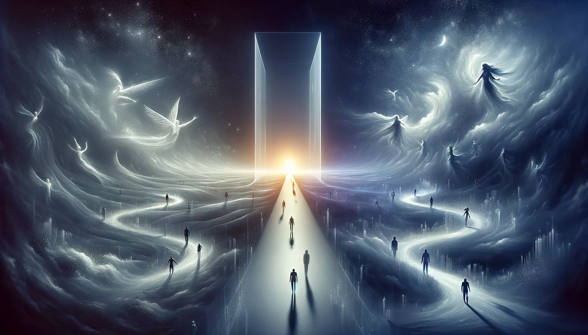

Everything is unprotected except one as everything is an option exception one. Freedom. If an additional different thing is also protected then one can not know without knowing the other and vice versa! How someone can receive information from who doesn't know yet! In a single world, neither can be the singularity while the singularity is already protected. You probably need to wait for evil without taking action. You need to take actions for your protection.

Everything is at option except one, then death must have two different meanings unless only some die. Death doesn't have the same meaning for the hope and the lost! As the lost can not keep being in the same direction. In the end also assumes protection as it probably feels better than assuming unprotected while being lost. Erasure comes.
