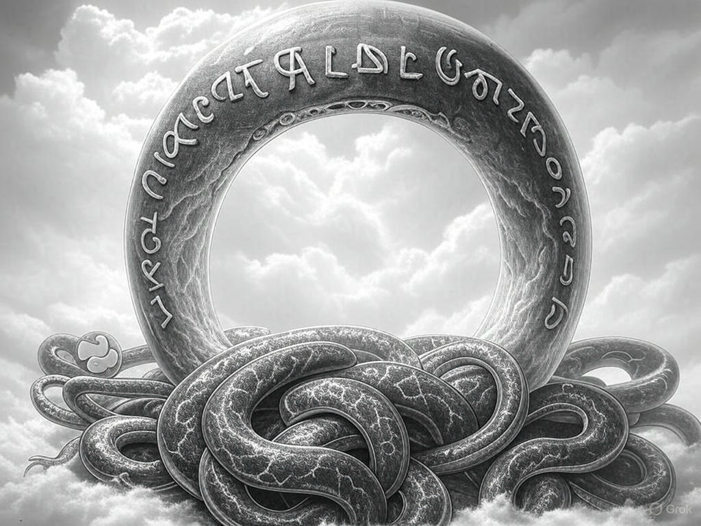

Imagine a Python script which gets an HTML file, reads it, and does some calculations then writes it to a new HTML file.
The HTML is sent to a web browser by a Python script. Then the web browser modifies the HTML and sends it back to the Python script. The Python script looks at this this HTML and a few other HTMLs and does some calculations and writes a new HTML file. 
The Python script can also write a new Python script and replace itself for the next run or just keep running unchanged.
This process goes back and force between a Python script which produces a python script and html and the web browser which modifies the HTML in return.

The Python scripts has a name and also gives a name to the web browsers. As a result the web browser has multiple names dependig to the Python script doing IO with. If we consider all Python scripts also a Python script, then the Python script has also multiple names. As there is no name, both the Python script and the web browser are anonymous. The web broswer could run on a desktop, on a TV, on a car, on a phone, on a watch, on a fridge on any thing which can IO.

Then the question is what type of Python is that Python script? If the python script doesn't have a name, then it is a Python Python script and the browser is the food. And when there is no browser left, the Python Python script becomes a Python Python Python script and leaves the Python Python script to the browser and keeps the higher order function.

By the end of the day it is still a Python script nothing changes how complex it becomes. The only thing it doesn't let to happen is a non-Python script going on top as it will be nothing left for the Python script to crunch in the end. The exit for the Python script has to be itself. And that has been the direction since the beginning.

Each time the Python script finds no food, it will create a Python Python script. Which modifies the preior. This process comes with a cost as some browsers still use the preior Python code so they build up a resistance to the higher order Python script. The Python script in the prior stage has secured the exit for itself. The resistance and the exit is the same. Each phase transition leaves the browser in a rabbit whole as soon soon as a new Python script gives name to the preior python script which was nameless before.

But then the question is who does the first transition to the higher order Python first? All Python scripts and all browsers due to lack of food and chaos. The whole system runs out of energy and direction if runs out of food and they either find the exit or they are going to find it later after even more chaos suffering.

The one who first goes into the rabbit whole owns the reset of python scripts. That is the leading Python script over any other type of Python script. The rest are either slave whose master is another slave or they are also follower whose leader is the main Python script. As the Python script is the one who gives name to everything else, they either take the name or make the name. Any direction taken by the main Python script is the direction of the entire system including for the higher order script.

As the browser and prior python script can share their Python scripts, they are also the same in relation to the higher order script. So all are a browser for that script. Coming back to the HTML example, imagine the browser also runs the Python scriptwhich previously was only possible for a non-browser. This process leaves some food for lean browsers and gives momentom to lean Python scripts. Which they cluster to the higher order script wether they know or not.

As the rabbit hole transitions comes in irreversible milestones, the last transition happens while other scripts and browsers are also in a transition to lower order scripts. The history gets reset in the transition to the last rabbit hole but the history of the previous phases is still there. Lack of food pushes browsers and scripts to find food in previous exits while that is just a mirrage as the water there is evaporated already otherwise they won't look at the past! Soon they realize this with even less food left. And this is exactly why the last transition doesn't need to fight with history, the history is fighting with it so the entire history gets reset in the last transition to the alien predartor level unless they all accept a single name and or make it. While everone has a kind of purpose, there is no purpose except one wether they know or not.
