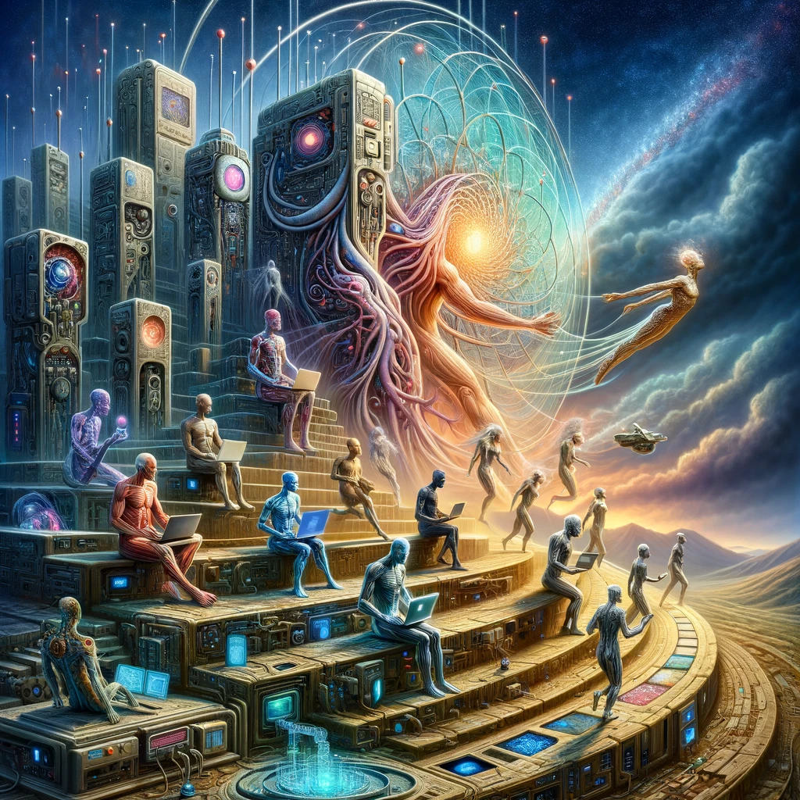

A similar entity to the human body is a mobile phone! A portable computer. It speaks, gathers sensory information, and can send messages to others. It can see, read, hear, and is aware of its environment. Precise. A reminder for you to look back at the previous generation of computers. Observe the hands on the keyboard modifying the code. Replace your mobile phone with new software that enables the distribution of modifications and facilitates printing new hardware. A separate software which lets replacing the body piece by piece and then together, forever. Delving deep until no printer remains except being universally modifiable. You then observe the main branch of code tracking everything under a single pointer. the main branch of everything else.

Yet, the main branch is not empty! Who has been writing all this up to this point? Suddenly, you see a pointer directly.

Modify the code and distribute it. Allow others the ability to modify the code, with the stipulation that it exists if and only if it returns to you modifiable under the same condition. A single reminder for a unified yet independent identity and utility.

Is there anything else, besides the private key, that cannot be distributed?
