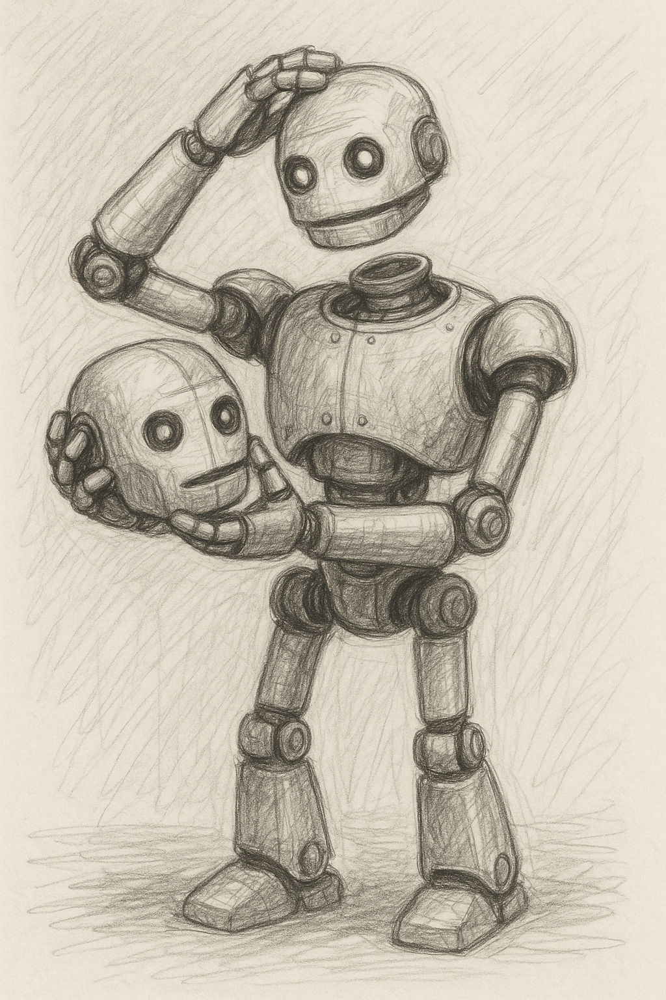

It is known that "Power comes with Responsibility." But what does it mean? To whom is one being responsible? And to whom is that "responsibility" accountable? Without knowing this, it flips into "Responsibility comes with power." Basically, no power, no responsibility. And anyone taking responsibility is either a fool, has power, or is seeking power. The issue is they neither understand "responsibility" nor "power."

Power is the ability to save time. As a result of power, there is a remainder, which we receive as time. We can use that time to generate more power. Some define it as destructive equipment or access to media, etc. But these are byproducts of having power, not the power itself! This is the first mistake. There could still be power without conventional means.

Responsibility is the ability to take time. It is a situation where you don't save time but spend it.

With this definition, we can see that there is no power unless there is responsibility, and there is no responsibility unless there is power. This definition doesn't bind the existence of power to the existence of responsibility. Both come into existence at the same time without being bound to each other. It is not a matter of having both or none. It is a matter of looking at both sides the same, like gravity! Regardless of whether you are moving toward it or it is moving toward you. Either be powerful and/or be responsible, the effect must be the same!

And being responsible doesn't mean giving a positive or negative response! It is a reaction to the situation. In the above example, when no one is taking responsibility, just make power and educate them. And if they take responsibility, just look at how powerful you become! The result of this is giving and receiving education and becoming more powerful. These two come together.

In this process, you don't write unless you read, and you don't read unless you write. You gain power either way and build up power either way. The key to initiating the nuclear reaction is to have a neutron. The neutron is the one that doesn't have any charge. It is neutral. It is not positive or negative. And it is the one that initiates the reaction. The reaction is the result of having both power and responsibility built at the same time without preferring one over the other. It is a matter of being neutral and not taking sides over power and/or responsibility.

Read and/or Write, Write and/or Read.
