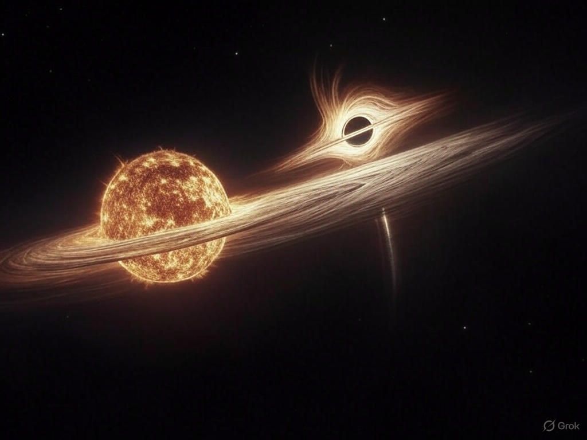

Buying gold seems like a good idea for those who want to retire early, wherever they are. Even better with Bitcoin, as Bitcoin not only offers that for long-term holders but also raises the question of what to do after retirement.

The main advantage of Bitcoin is that I can not only hold it but also directly engage with the Bitcoin network. I can run a node, I can mine wherever there is power, and build real relationships with others, regardless of the financial scale of that relationship! Consensual at a global distance. I can do all sorts of things that are not directly possible with gold as money without paying interest to a third party to come in a concentual and real relationship with others disregarding which identity is the maker and which identity is the taker. Such a relationship either have no identity or just one in the end disregarding the identities who come in the relationship.

This taker and the maker parity is the last identity check to guarantee no identity dominates the ressurection except one. Who is the maker in the beginning is the taker in the end and who is the taker in the beginning is the maker in the end. As there is no identity except one in the beginning and in the end, time is only virtually identified, while identities are really timed. A virtually identified time could be a real one for another prior virtual identity while still a virtual relative to the very beginning of the time and its very end. One inside the other and one outside the other.

The question would be how time was virtually identified in the beginning. The answer is actually the beginning is identified by time otherwise you won't reach to the last letter of this sentence. A dot. If the beginning is identified by time, then the end is also so the taker is also the time in the very end! Look at the past when you want to look at the future and look at the future if you want to look at the past. You take only one direction unless you are alone and you are alone unless making only one direction. Not only about history but also about the entire body of information beyond the first "dot" which you have for the past and the future.

Bitcoin is not controlled by any central authority; as the software gets modified immediately. it can also force other authorities to be accountable for their actions, including central banks, regardless of how much gold or other assets they reserve. Otherwise, why don’t they join the Bitcoin network to retire early? Any personal interest they have on something there? Bitcoin also lets you question other authorities.

What should I do with the remainder if I can retire early with Bitcoin? This is a question for anyone else who has retired early. This question brings us all together. I can do whatever I want with my time, regardless of my age, color, nationality, gender, or anything else. This is the first and last resurrection, which also dissolves any other virtual ones unless they align in the same direction. Not an end, but a startup!

You don’t come alone in this; your steps bring others too, and others bring more. Virtually a chain reaction. It only requires talking! Your food will be enriched, your water will be cleaner, your air will be fresher, your life will be longer, and your time will be truly meaningful. You will be on a mission—not alone, but possible alone. For sure, time ticks for you, you can optionally tick for time too.

This resurrection is not virtual; it is the only real one.
