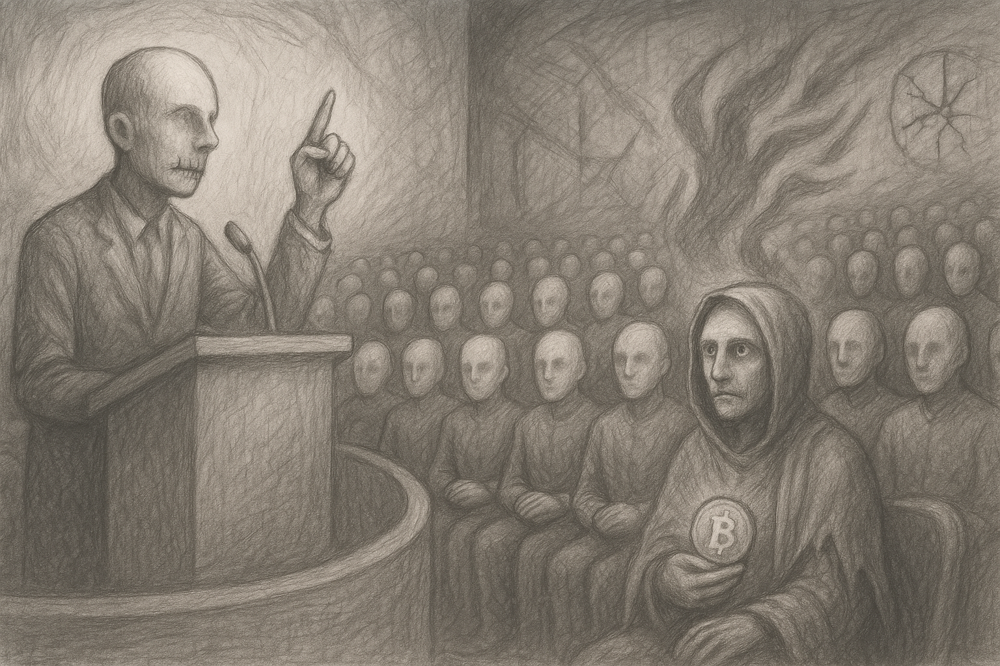

Have you heard the one saying that "You are like those save in non-BTC. You see them as enemy and they see you as enemy and your fight is about getting power and when you overcome they are going to repeat the same and this is a pointless never ending war, and let's stop all wars and accept the current situation. We are all the same!"

OK! Assuming BTC forgets BTC, does the other side also forget BTC?

Does the other side stop keeping and accumulating BTC and or non-BTC? Not only I lose BTC but also everything else! Wouldn't I become a real threat to the other side later on? Then! They are going to ignore me then?

The one who saves in BTC and only in BTC isn't always different from others who mix it and those who mix it also agree with BTC in some extent while BTC doesn't agree with them in any extent about the future.
Even they leave some future to BTC but BTC never leaves any future to them. Are they the same?
BTC doesn't consider any owner for the future, it considers the future as a whole and it is not going to leave any future to any owner. Is this the same with other ones?

BTC doesn't allow owning the future to anyone else, is this the same as any other?
And there is no other future except eliminating BTC, can you do it while BTC planning everyday how to eliminate the other futures?
Is this the same?

If they are all the same, there must be one which is not! The main issue hidden in the first narrative.
Is that one BTC? Otherwise it will be an endless war and BTC is right.
