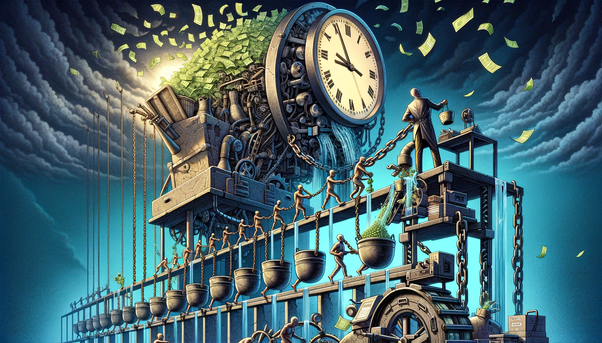

If we reduce our needs to food, water, a jacket, a T-shirt, some shelter, railways, and use a bicycle to move around the city, it doesn't need a billion people working to provide all those. Technology would allow us to save more, which basically means getting more stuff with less work. So, we can use it and save time to produce more technology to the point that we can save even more to spend time on future developments. Thus, working can have just one purpose, which is saving more! Or in other words, giving us time to do something that saves even more time for us in the future. Wealth. The heaven of abundance. Not only for me, but also for us. But you don't have to choose this. It is optional.

If you cannot save in money, you will save in something that loses its value over time to the point that there is no saving left for you. No saving means no chance for you while you cannot skip working. You get probably punished for claiming your rights! It doesn't keep being in that state, you lose more just by time to the point that you are just more valuable dead. This is a permanent war! Which you can plan for step out.

And money, by definition, is something that no one else can control its supply. Otherwise, you are just hired by the one that controls the money supply, even if there is another name on it. This means either you don't work but you earn, or you don't get any work back for the work that you perform, or both. But the right way is neither this nor that, so this is theft by definition. And theft grows if not stopped. And it is not sustainable as there is nothing effectively to control the money supply globally. The one which is most efficient and accurate cannot be stopped.

Saving in hard money is saving me, is saving you for the best in us.
