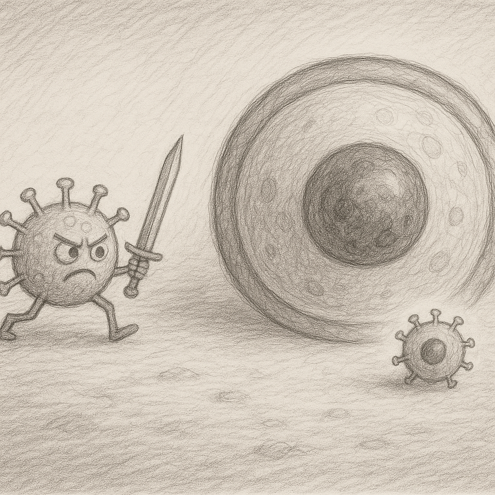

The term "secular" is defined as "of or relating to the worldly or temporal," "not overtly or specifically religious," "not clerical," "not bound by monastic vows or rules," "occurring once in an age or a century," "existing or continuing through ages or centuries," or "of or relating to a long term of indefinite duration."

If everything has to be secular, then one must be non-secular! But then how can secularism itself be indefinite and/or long-term, or occur once in an age or a century, or continue through ages or centuries, etc.? But what if the secular suddenly becomes anti-non-secular? Murder it and/or censor it?

A secular government is one that doesn't have any permanent part; all parts can be changed and modified, otherwise it violates its definition! How can something be temporal when many parts are permanent? By definition, a government implements the law—a computer that runs code and uses the result for actions. Such a government can have replicas, like how a computer program can run over multiple nodes, even in the same data center! There is no limit to how many secular governments could exist; there could be one government for each and every individual! Like a software program that can be copied and modified by the users too!

A secular government, as a government, has suction and succession, and such a thing is absolutely an anti-secular government. A secular thingy is an electronic circuit! Giving the shotgun, media, money, religion, etc., to a single electronic circuit is to wipe out everyone, including the electronic circuit! This is a rabid madness with suction and succession.

And those who advocate for a secular government by holding roles in it neither understand the government nor secularism! They are neither a government nor secular. They even betray the software and the circuit. They don't even allow a real secular government to form, one accessible by each and every individual! Not only are they anti-secular, they are anti-history and anti-software! They are anti-language. And there is no censorship bigger than what is made and applied by a circuit holding an automatic shotgun.

The argument against such a single person is "it is not secular," while they cannot be secular either. So they have to come and actively act against the ultimate personal ruler in general. The question for them would be: Is that the most dangerous enemy to them? There is no limit in general, how much power is concentrated in the hands of a single person, as power is a means for something else in a non-secular government.

The formation of a government that pays interest to a single person is the end of the nation-state, and the nation that is in this discipline is going to be predated by non-legitimate governments, and they will receive maximum pressure from the non-legitimate governments in return. That is exactly the reason for the existence of the non-government as a defensive measure.

A non-government also collects interest from any other speaker, clergy, bank, governments, religious communities, etc. In this situation, there is actually no religion independent unless it is defined by the one who has control over the non-government in its boundry! In other terms, all other prior projects have already delivered their result, and history is already reset.

If this resets all histories, there must be one not reset and that is made by and for the formation of a non-government. With the difference that it is worldwide and it is beyond non-government itself and provides all those functions. And more importantly, why not give that to everyone on the planet? The barrier to this is history being used for the formation of non-government, and the non-government is formed inside the boundaries of a region, under a local name, speaks in a local language, and comes with traditions that are already opposed by governments outside the boundary! The protection is like a shell that has to be broken outside the first boundry.

To solve this, the ultimate power should be hosted outside the boundaries of the non-government, like a king's crown that is first lost and found inside the enemy's territory! That breaks the shell without any effective resistance! And that ruler also comes with a circuit and software that actually replaces the functions of what is called a "secular government." You can have a secular non-government in your pocket! Which is modifable by you without asking permission from your enemy!
