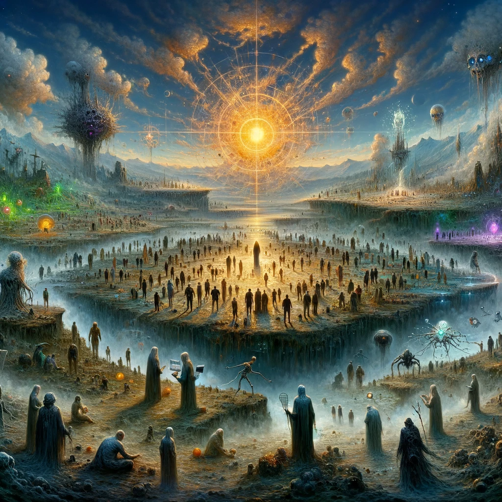

Singularity is inherently natural. The question is, why does being natural matter?

Being natural implies that it occurs spontaneously, without any external authorization, at the precise moment. This is the essence of the ultimate singularity. Therefore, prior to this moment, other singularities exist in a virtual state, paving the way for this unique event. These virtual or artificial singularities merely represent facets of the ultimate singularity and should be regarded as such.

Consider a scenario where an assembly aims to select this singularity. Firstly, such a singularity cannot be chosen by a group. Moreover, the assembly would ultimately make a choice, for otherwise, its formation would be pointless. They would likely select someone familiar, a concept contrary to the nature of singularity, which is a step beyond everything, including the assembly and its members.

Thus, the assembly can only choose someone they deem suitable for the role. It is akin to a movie.
