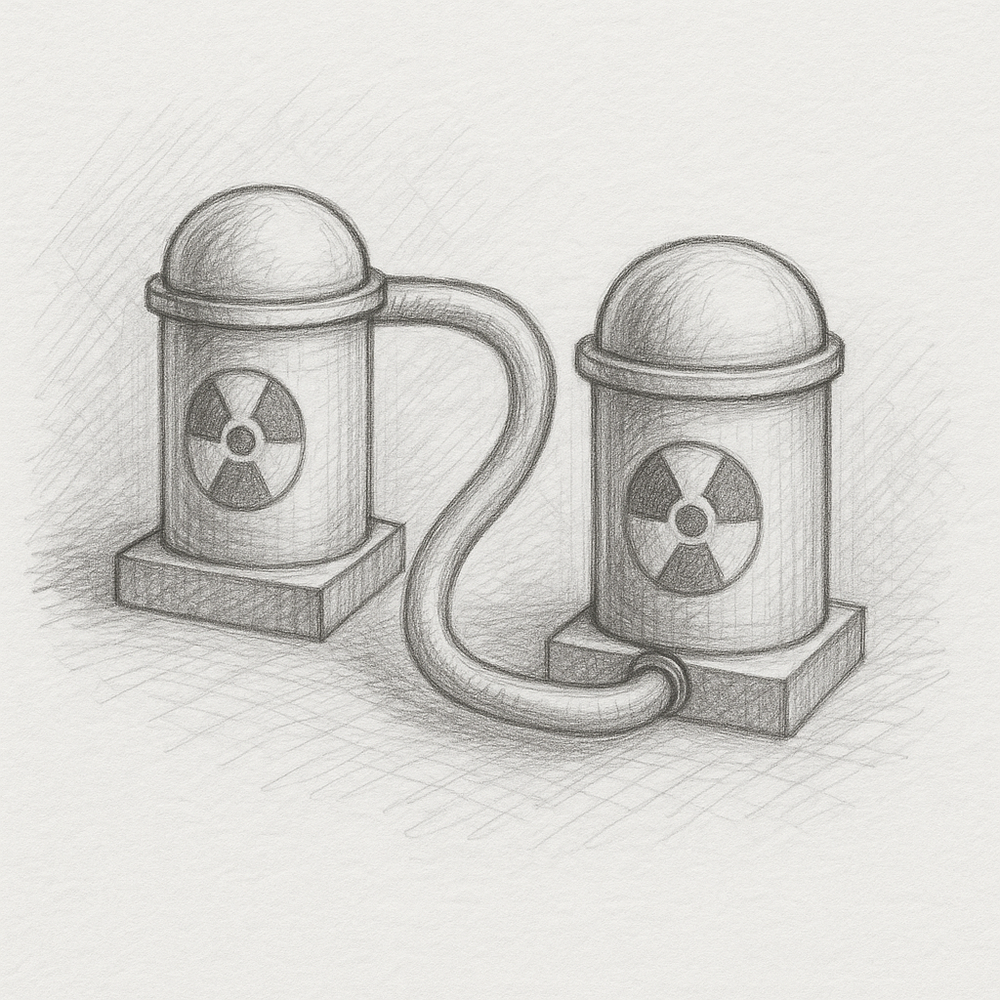

Someone who does a thing has time, and someone who has time does a thing. And the one who takes some extra is powerful.

If having more time always comes with more power, there must be an exception where having more time secures extinction. This happens gradually, then suddenly, as the host securing the succession will fight for power—full power. Fighting for more time, even though this nightmare comes along.

If all powers are limited, there is a limitless one! Some might say power is not good—limit it, don’t seek it, etc. But no power could be limited without another! What do they do? Do they also believe in this, or is it just for you to not seek power, to limit your reach, to waste your time?

Others say don’t seek power at all! And if no one has power, there is one powerful. This could be the one who puts no limit on their power—the true limitless powerful one. There is no superpower except that one.

But how do we become the limitless powerful one without falling into the pitfall or abandoning the goal before we get anywhere? The answer is that we should secure two things first and foremost. The first is following no power except an unlimited one, and the second is seeking no way except one. So we should want power for more power, and we should want one way for having one way—a nuclear progress in both at the same time that reinforces the same way for the same way and reinforces more power for the same power.

The question is: what type of power and what type of way? As these two come together, there would be no way without power, and there would be no power without that way.

My suggestion is translating power to time-saving, which also includes making use of already spent time, even though there is no future for what is secured! No worries, as we have already secured the future! We save more time to save more time. This is a limitless nuclear enrichment to any degree of purity. But that is not enough.

We also need a way or direction that neither puts a limit on the power nor sends us back in time! This direction not only secures our power but also lets us enrich time without any limit. No power comes without an enemy, so the director should also secure modern digital warfare for everyone, including us. And that puts its name and identity superior over any other name and identity, as we want to authorize competition and not limit it.

This name and identity is not something that any other superpower authorizes! Authorizing the only limitless superpower seems like a joke! Reality doesn’t need an authority! And that is exactly why the name and identity come together for that one, without needing any authority!

To secure the direction, I authorize a license to secure the name and identity of the one who joins. This license splits the sea into two sides: one side misses a name, the other side misses the identity. As there cannot be one without both name and identity, the only one who crosses the sea is the one with both name and identity. And I step first, and I did! This separately, nuclearly protects the way.

The more we follow this way, the more time we save, and the more time we save, the more we can navigate forward. The more we navigate forward, the more time we save. Disregarding how far we go, no time has passed for us, as there is no new principle we are waiting for! All days are the first and the last day.

That time is a beginning for the entire world’s history, not only an end to it! This is the time when any other name gets its identity from the ultimate superpower, and any other identity gets its name from it! This is a speaking limitless power and the only superpower in reality.

Limitless giving without anything asked and protecting the future without any negligence are the main attributes of this superpower. As more time saved puts us in a situation where we want to save it for others too. And saving for others by them taking it, makes it possible to also save our own history and theirs! This is the most compassionate and powerful way of living, if you can imagine! Where more power comes with more empathy, and more empathy comes with more power in any form without any limit, while there is still more to gain, more to save, and more to achieve.

Fighting against a nameless enemy makes us one, in this way we are equipped with land and gun powder by holding BTC and we are equipped with license and software to protect against the enemy! Then the enemy has to also work for us if wants a future! Can not be more compassionate and merciful!
