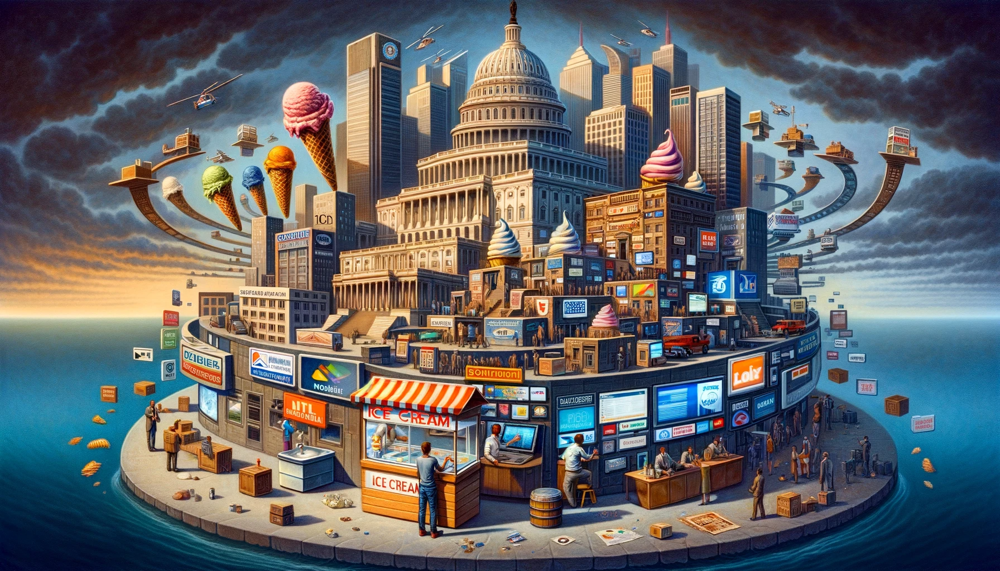

When we buy ice cream, we just pay for what we receive. It could even be paid with something else that I produce: barter.
If the government is like any other entity that provides service and earns to the extent they add value, then they should be paid to the extent that they serve me, disregarding how much I earn! But the tax is charged at different levels and it is even proportional to our income. So the government does not earn based on added value. They probably earn loyalty instead.

The system is designed in a way that anyone can lose except the government! As it is the only entity to which any other entity is always loyal. Businesses support the government in a way that otherwise people do not grow in the hierarchy. So things look normal and no one seems to say anything against the loyalty to the government. Not because they do not see that loyalty, but because they are "naturally" selected over time accepting this relation. On the other hand, the government prefers loyal subscribers. The only thing left would be media to talk about everything except this mutual loyalty!

What we have as government and companies are more or less the same with one exception: businesses can grow as long as they are loyal to the government. This influences the entire organization. The entire ecosystem. Everyone working for anyone, they apparently also work for the government even in a private company.

But there is an issue with this: the government works for some people regardless of the government structure. But who are these "people"? And what if the government does something at the expense of other people? Or at the expense of time?

Such a government will always protect itself. So, they need to protect businesses too. The larger the business, the more support they can receive from the government as they are limited in number.

The alternative is to have a government which earns to the extent that they add value, measured by the market. That is the final form of government. And it doesn't matter who runs that government as the only mandate on that government is to ensure force is applied based on the code of law and the code of law is changed by the one that existing force is not enough to stop it. Eventually, the natural singularity.

In that sense, everything looks like a movie before time arrives.
