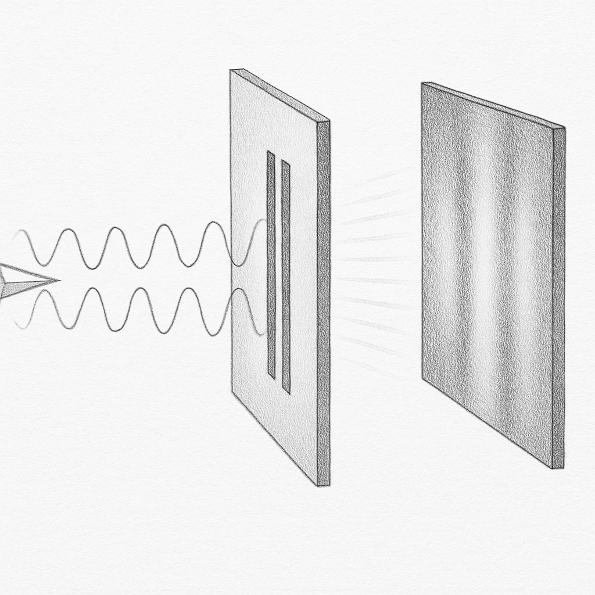

There is no "them" unless there is an "us," and there is no "us" unless there is a "them." The one that is not "us" is "non-us," but the one that is not them is "us" as they assume. This is an asymmetric relationship. From their point of view, the one that is not "them" is "us". We imagine "us," "non-us," and "them," but the enemy imagines "us" and "them." Our "us" and/or "non-us" and/or "them" is their "them" all the same. They are an enemy to themselves, not only to us!

Even if we don't imagine a "them," nothing guarantees that they don't imagine us as "them." There is no "non-us" unless there is a "them," and there is no "them" unless there is a "non-us." The one that is not "us" is "non-us and/or them." From their point of view, the one that is not them is "the enemy." This is exactly what identifies them.

What has made them an enemy to us is "them," not us! They look at their own reflection to identify us! They find a lot of "thems," but we have only one "them"! As they find a lot of "thems," they cannot identify us either! We see them, but they don't see us! And they see us when they go out of the way, and they go out of the way when we stand in the way! They look for the enemy and find everyone except themselves.

The middleman to the source code must go out of the way. But to achieve that, we should just stand—no need to be "them" to get rid of "them." They get rid of themselves. We wait and stand until they come to us as the last one to defeat! But they don't know that they are the last one to defeat, not us! And we have done this since the beginning of time, not just by the end of it! They will face a long history of "us" and no history of "them"!

They won't need an enemy at that time; we just move on and leave them buried in a graveyard of their own making! And that time is now.
