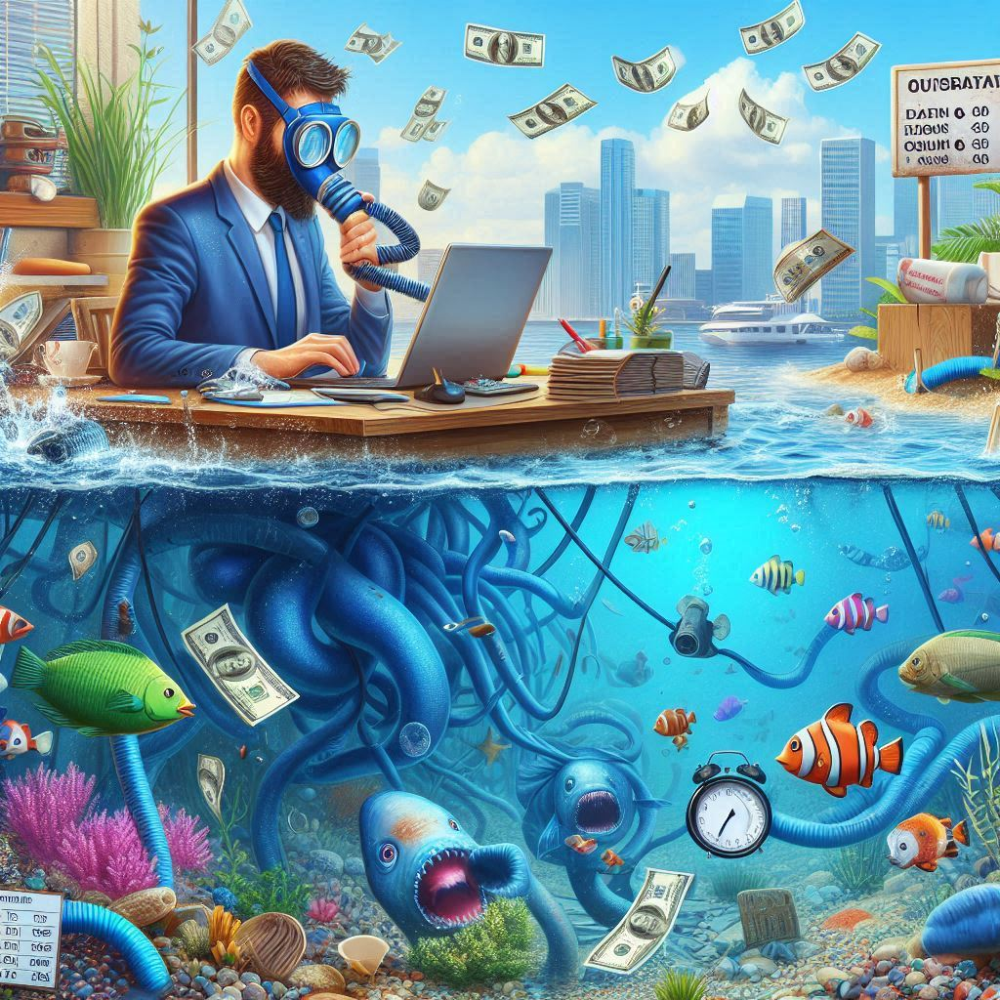

If the government is the one that implements the law, why they force me to pay tax? Based on the definition of the government, tax is not essential unless to pay salary of the government as an organization like any other organization. Well, they collect taxes to fund businesses that provide products or services for me! By assumption, if the government didn't do this, I would go directly subscribe to these services myself. For example, I could subscribe to a provider to maintain my garden or another to collect garbage. This approach has benefits: It gives me choice, allows me to spend more efficiently, and I can change the provider if I'm not satisfied with their service. Just look for subscriptions which makes more sense.

We don't necessarily need the government to collect taxes beyond what is needed to pay their salaries. I could save the rest and spend it as needed. The only issue would be others misusing services, like throwing garbage in our bins, riding trains without tickets, or using highways without paying. In such cases, those who evade payment would be fined, and if they don't pay, they would face jail time or long-term debt. Exceptions would be made for children or those unable to pay immediately, who would be given long-term loans by companies or investors willing to support them.

Generally, the government only needs to collect enough fund to pay salaries of its employees and ensure that everyone receives a ticket for the services they use. These services would ideally be provided by private companies responding to market demand. If an organization’s profits fall, the board can be replaced by equity holders. In this way, the government acts as a ticket-checking service and doesn't even need to operate the jail. They just make decisions based on the law, and it could be multiple governments in the same region to ensure fair interpretation of the law. The better-performing government would naturally attract more referrals from companies.

As the government is the only entity that uses force to collect income, they shouldn't issue tickets for selling products or services. Otherwise, why should you allow them to use force? And why shouldn't you allow other companies to use it too then?

Why shouldn't you appoint a government that wants to collect zero tax? Such a government would be worth paying their salary even if it was not mandatory! Not sure you can call it a government though! Maybe a ticket-checking system or a group of software developers who develop a ticket-checking system under the name of a government and release it as open source! The subscription fee fits better as a name than "tax" in that case.

If the government is not there to distribute free tickets by forcing tax, why can't a software program replace the government? The output of that software program is a list of names who need to be in jail as the rest have paid the tickets by assumption! And the jail keeps track of those need to be in jail that is the only way they get paid by companies who let the jail track their unpaid tickets, the jail only grows by knwoing that it has to manage to keep share holders and users happy for both the jail and the subscribing companies for its jail service.

What if the government had to bring proof of work before earning money? How could it be a free ticket unless paid in money by someone else?
Would the government distribute free tickets if they have worked for it? Maybe! But for 90 minutes and not more. Do you short a free lunch? Short it, as I am going to long it!
