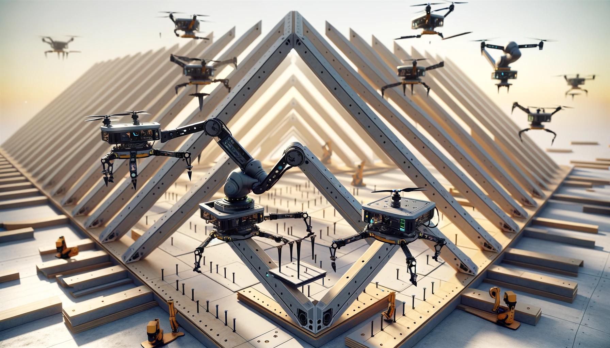

If we view the real world as we do the digital world, then we can use digital arguments to create real-world objects. It's not necessary to model every aspect of a real-world object, like subatomic particles! These could be encapsulated as reusable functional building blocks in the digital twin.

A triangle is an excellent starting point. Almost any real-world geometry can be approximated with triangles. Even cylinder-like shapes can be formed using triangles. The cylinder, sphere, or cone can also be considered additional building blocks, but for this analysis, we'll continue using triangles to construct a real-world counterpart based on the digital twin.

Imagine a generic assembly method that connects triangles, like a robot arm that attaches to a structure and adds triangles until the structure is complete. The robot arm moves forward to the position for the next triangle, letting the structure self-assemble. The next screw and bolt positions are determined in the digital twin, and the robot executes predictable motions based on this knowledge to position the next triangle.

To scale this, the triangles are pre-built as bisected equilateral triangles (30-60-90 triangles). Holes are pre-drilled for assembly. The arm attaches a new triangle to an existing one, adjusts the angle with a configurable joint, then secures it. This process can be reversed for disassembly.

Structures can be final forms or molds for casting, which might reduce the number of triangles needed. Robots, possibly aided by drones, can assemble or disassemble structures.

Since triangles have a size limit, they also have a weight limit, enabling the construction of large structures through the collaboration of small robots. The base size of the triangles can be varied to suit large or tiny structures, depending on the size of the assembly robots or elements.

This vision allows us to envision printing large structures automatically using smaller pre-built elements produced as standard commodities. In this world, a design is merely a computer file, tested, verified, and guaranteed to be built automatically without human intervention wherever these elements are available.
