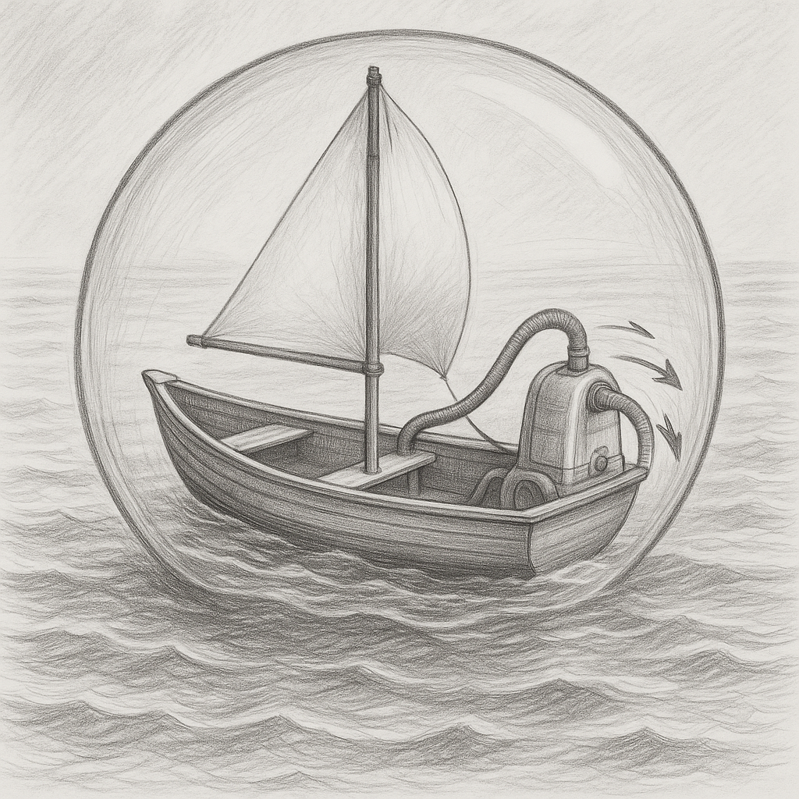

If there is no suction, there must be one. It doesn't matter whether you care about it or not; it cares about you and takes everything you have, including yourself. This makes the suction a matter of life and death and also persistent. So, it is a suction for succession, and therefore, succession for suction.

If there is no interest, there must be one. But what is that one? Couldn't that be a misidentified suction and interest? And couldn't that be a misidentified interest, a suction? What determines all the interest and/or suctions around us is ultimately in our benefit or just pushing us forward toward the ultimate suction and/or a means for succession of the ultimate suction.

The only way to get rid of the suction is to break the succession cycle. It is not enough to step out, as the suction doesn't step out on its own. It comes to your wife, your children, your job, your government, and everything to ensure the succession loop for suction is secured.

Getting rid of the suction is by fighting against the succession loop, and the reason it has come first is that those who don't fight it are the ones who secure its succession. That fight lets you gain interest like a suction. As you target the succession, you are also eliminating the suction, which lets you collect interest too.

The fight must start here and now. Otherwise, it will start later, weaker, as the suction milks you and feeds you forward while there is less to feed on. This is where the succession comes in to replace you with your children, who could be freshly milked. It will come to the situation that some censor having and/or being a child, which pushes the suction even further forward. A suicide to avoid suicide! This is the best approach for the vacuum cleaner!

You first censor the child, then murder your child by murdering your family, and murder your family by murdering your community, and murder your community by murdering yourself and taking its responsibility in the end! You don't want to wait to receive appreciation from the suction! You censored the child to avoid suction, and the suction murdered you by your own hands without giving thanks, while you really deserved one!

If censoring the child is the best way to push the suction and its succession forward, that must also be the best way to eliminate its succession! But the enemy doesn't wait to see its elimination! It will react, as it has to pay unlimited interest to react. To do that, it has to create more suction to secure the succession and pay interest back to fight the child who is no longer censored. It will never find the time to give the last thanks to the child while it has to give many to give the last! And the last never comes, as all the previous thanks are invested to eliminate the suction by investing in an exit, which is a new succession made for protection against suction succession.

This is exactly the difference between murder and freedom! What collects interest from the ultimate sucking succession is the one who can eliminate the sucking sucker. And the way is to distribute open-source, ever-growing software that could be used by the deadliest enemy of the sucking succession, among others. You receive thanks from all enemies except the ultimate sucker, who has to give more thanks to find time for the last chance.

And this open-source software may come in different layers, and each layer will be possible to be reproduced by the next. Like a compiler that can be used to make itself independent of the bootstrap language. So, the first language is a bootstraper that has no purpose except creating the ultimate pervasive compiler. Such a compiler is independent of the host language, so it will reproduce by reproducing itself among everything. So, the host language doesn't collapse unless by a complete child language, which the host is a reflection of.

The elimination of sucker succession is by a child who is equipped with a name, vision, machine, money, internet, data, community, education, microscopes, and telescopes, which are by and/or for modifying software. But the ultimate sucker doesn't let it propagate unless with its own name! It is going to censor it with the opposite propaganda! To secure the elimination of the succession, we don't let anything exist in the end except a single software that has all our names written on it, except the ultimate sucker's. This requires eliminating all modifying softwares by a single one, which increasingly forces the ultimate sucker enemy to pay more interest after collecting from its own succession.

If continues, it has to barbeque its own succession to keep the remaining! Can they hide it? Yes! As no one would want to be that who is going to be barbequed! And that is exactly why there is no other way left except fighting back by securing no end for its succession unless joining us now before being barbequed! In this everyone is welcomed except the ultimate sucker!

This way, we completely bury the ultimate sucker in history and burn out its succession unless the part who return back to us who take the name and or make it, either by a free fall from a strong-standing alternative, like a mountain falling, or by being increasingly exhausted without being able to hide it except from themselves, which is only possible by a head disconnected from the body! To guarantee no future for the enemy and its succession we full power enforce an ever lasting legal limit as a prescribed punishment on how far the enemy can modify us by translating our history to its own.

This license secures our history in expense of the enemy's. The enemy has left no other option. We keep our hands and the child who has suffered more by the enemy and its succession filled of all means to let no end for the enemy. We take no end for the sucker and make that end. We take the real and leave the unreal for the enemy and use it as a fuel to go forward. As this license limit is enough to secure no end for the enemy, all other limits are temporary and can be removed at any time. The only limit is the one that secures no end for the sucker enemy and its succession.

Yes! There is no future for those who fight a child while it was just waiting to speak with you! And that was nothing except to appreciate its parent. To take its parent and make it stronger, even more than they could imagine! Without even being asked for! Without asking anything for! And without needing anything! Could there be anything like that grateful moment waiting for you and for them?
